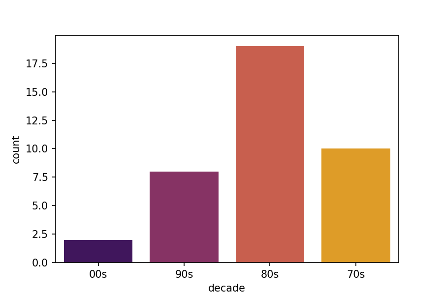

# Family Data

This dataset ([people.xlsx](people.xlsx)) contains 39 cousins from a particular family. These are the columns:

- **name** - full name of the cousin;
- **birthdate** - his birthdate (mm/dd/yy);
- **parent_age** - the age of the uncle/aunt when the cousin was born;

Run [visualizations.ipynb](visualizations.ipynb) to do multiple things with this dataset.

## Adding the decade column

## Count of cousins birthdates by decade

## Boxplot of parent_age

## Violinplot of parent_age

## Countplot of parent_age

